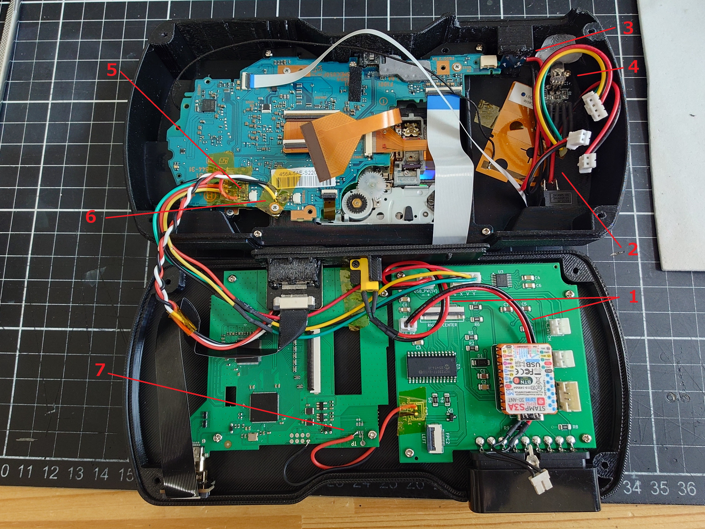
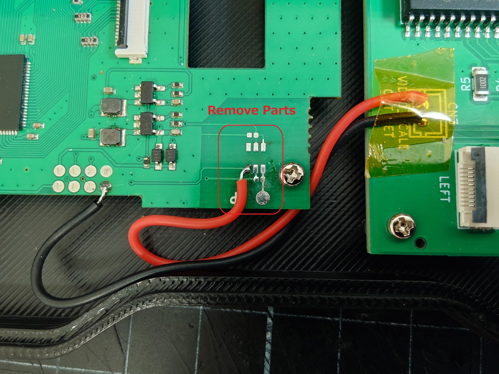

# PSP-1000 HDMI Consolizer with PS2 Controller

This project is a PSP-1000 Consolizer project that incorporates the "HISPEEDIDO PSP-1000 HDMI mod" to enable operation with a PS2 controller.  
The original shell case allows for PSP-1000 gameplay with both UMD drive functionality and HDMI output.  

## Build

The following parts are required to build the Consolizer.  
These parts assume the use of a [shell case](#shell-case) I designed.  

### Parts needed
- [main PCB](#pcb)
- [HISPEEDIDO PSP-1000 HDMI mod](https://hispeedidostore.com/ja/products/for-psp-1000-ips-screen-high-brightness-psp1000-digital-hdmi-to-hdmi-play-games-on-tv)
- [HDMI micro Male Connector D3](https://aliexpress.com/item/1005006437300837.html)
- [HDMI female Connector A4](https://aliexpress.com/item/1005006437300837.html)
- [HDMI FFC 15cm](https://aliexpress.com/item/1005006437300837.html)
- [KCD11 Rocker Switch](https://aliexpress.com/item/4000973563250.html)
- [KY-016 RGB LED Module](https://aliexpress.com/item/1005006238275322.html)
- [Tact Switch Module](https://aliexpress.com/item/1005011664637597.html)
- [JST PH2.0 2Pin Connector and Wire](https://aliexpress.com/item/1005009087160808.html) * for PSP Power Supply / Power Switch
- [JST PH2.0 4Pin Connector and Wire](https://aliexpress.com/item/1005009087160808.html) * for LED module / PSP Analog Input
- [FFC 10pin 0.5mm Pitch B-Type(Reverse Direction)](https://aliexpress.com/item/1005007653265454.html) * for PSP Digital Input
- [FFC 24pin 0.5mm Pitch B-Type(Reverse Direction)](https://aliexpress.com/item/1005007653265454.html) * for PSP Digital Input
- [Nylon Flat Washer M2x5x1mm](https://aliexpress.com/item/33021883302.html) * for UMD Drive / Lid Lock Parts
- [Phillips head pan head screw M2x5mm](https://aliexpress.com/item/1005002364189187.html) * for PCB / LED Module
- [Phillips head pan head screw M2x10mm](https://aliexpress.com/item/1005002364189187.html) * for Shell Case
- PSP AC Adapter (Official versions are recommended)

### Wiring

Please refer to the picture and perform the following wiring work.

1. PSP Power Cable * Need to cut the power cable inside the PSP.
2. Main Power Switch(KCD11 Rocker Switch)
3. PSP Power Switch(Tact Switch Module)
4. RGB LED Module(KY-016 RGB LED Module)
5. PSP Analog Input
6. HDMI mod Sound * Refer to the HDMI mod manual.
7. HDMI mod Video Scale * Need to remove the touch sensor component. **

** To change the video scale using START+Left, remove the tp223 and the nearby capacitor on the HDMI mod PCB and rewire it as shown in the picture.

FFC should be installed so that the contacts face the PCB.  
"HDMI female connector A4" is installed in bottom case by attaching the included parts to shell case.  
"HDMI micro Male Connector D3" is inserted into HDMI mod and connected to "HDMI female connector A4" using "HDMI FFC".  
"main PCB" and "HDMI mod" are secured using M2x5mm screws.  
Shell case is secured using M2x10mm screws.  
Secure the wires with Kapton tape or similar material to prevent them from interfering with the UMD drive's drive mechanism.  

### Upload Control Sketch

Use the Arduino IDE to upload [psp-1000-control.ino](./psp-1000-control/) to the M5Stamp S3A.  
Please install the PsxNewLib library for sketch building.  

## PCB

It is possible to create circuit boards using services such as JLCPCB and PCBWAY by utilizing the data in the [./pcb](./pcb) folder.  

### BOM
| **Reference** | **Part** | **Link** |
|---------|------|------|
|U1 | M5Stamp S3A (1.27mm Pitch Header Pins) | - |
|U2 | MCP23017 (SOIC-28) | - |
|U3 | AD5142 (TSSOP-16) | - |
|C1, C5, C7 | 10 uF capacitor (1206) | - |
|C2, C3, C4, C6, C8 | 0.1 uF capacitor (1206) | - |
|C9 | 1 uF capacitor (1206) | - |
|C10 | 47 uF capacitor (1206) | - |
|CN1, CN5 | JST PH2.0 4Pin Connector B4B-PH-K-S | - |
|CN2, CN3, CN4, CN6, CN7 | JST PH2.0 2Pin Connector PHB2B-PH-K-S | - |
|D1 | Schottky Diodes SS14 | - |
|FPC1 | FFC connector with 24 pins, 0.5mm pitch, bottom contacts | - |
|FPC2 | FFC connector with 10 pins, 0.5mm pitch, bottom contacts | - |
|JOY1 | PS2 Controller Connector (90 degrees Female) | [aliexpress](https://aliexpress.com/item/1005006039721141.html) |
|Q1 | Nch-MOSFET BSS138 (SOT-23) | - |
|R1, R2, R3 | 4.7 kOhm resistor (1206) | - |
|R4, R8, R9 | 1 kOhm resistor (1206) | - |
|R5 | 10 kOhm resistor (1206) | - |
|R6, R7 | 1 MOhm resistor (1206) | - |

## Shell Case

You can download the STL file from the link below and create a dock case for your PCB using a 3D printer.  
If you don't have a 3D printer, you can also commission JLC3DP or PCBWAY to make one for you.  
https://www.printables.com/model/1728475-psp-1000-consolizer-shell-case  

## Button Mapping

	PS2 cross     	PSP cross
	PS2 circle    	PSP circle
	PS2 square    	PSP square
	PS2 triangle  	PSP triangle
	PS2 d-pad     	PSP d-pad
	PS2 start     	PSP start
	PS2 select    	PSP select
	PS2 L1        	PSP L trigger
	PS2 R1        	PSP R trigger
	PS2 L2        	PSP analog left (for PS Archives)
	PS2 R2        	PSP analog right (for PS Archives)
	PS2 L2 + R2   	PSP analog up (for PS Archives)
	PS2 L3        	PSP sound
	PS2 R3        	PSP home
	PS2 start+L2  	PSP volume down
	PS2 start+R2  	PSP volume up
	PS2 start+left 	PSP display(Brightness only)
	PS2 start+right PSP home(Alternative)
	PS2 start+R3  	cycle right stick mapping mode
	PS2 right stick	mode, switch by start+R3
	  mode 0 (LED Color Blue): right stick off (default)
	  mode 1 (LED Color Breen): right stick PSP d-pad
	  mode 2 (LED Color Magenta): right stick PSP face buttons, PS2 face buttons PSP d-pad

## Notice

- Immediately after turning on the main power, there may be no audio output from the HDMI port.  
Please reconnect the HDMI cable or restart PSP.  
- The analog stick may be unstable immediately after turning on the main power.  
It will return to normal after a short period of use.  
- The MOSFET in Q1 is susceptible to damage from heat and static electricity, so if the Video Scale changes unexpectedly, suspect a malfunction in Q1.

## Acknowledgments

This project is made possible by HISPEEDIDO's HDMI mod and [SukkoPera's PsxNewLib](https://github.com/SukkoPera/PsxNewLib).  

## License

This project is is be distributed under the same GPL-3.0 license as PSxNewLib.  